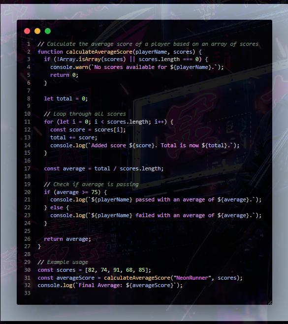

# 🌌 Violet Dark Theme

A futuristic and minimalistic theme for Visual Studio Code, inspired by neon lights, cyberpunk landscapes, and late-night coding sessions.  
Perfect for those seeking a sleek dark atmosphere with vibrant purple tones and neon accents.

---

## ✨ Features

🎨 Modern, eye-friendly color palette:

- 🖤 Deep dark tones to reduce eye strain.
- 💜 Accent colors in purples, violets, and magentas.
- ✨ Soft and elegant contrasts for improved readability.
- 🌃 Inspired by futuristic, night-time environments.

📝 Enhanced syntax highlighting for:

- **JSON**
- **CSS**
- **HTML**
- **Python**
- **JavaScript**
- **TypeScript**
- **and more...**

🔍 Optimized highlighting for:

- 🛠️ Function, variable, and method names.
- 💬 Differentiated string colors.
- 📑 Keys and values in JSON files.
- 💭 Stylishly distinct comments.
- 🔢 Numbers and keywords.

---

## 🖥️ Preview

Immerse yourself in this dark, neon-lit atmosphere:



## 📦 Installation

If you downloaded the VSIX file manually:

```bash
code --install-extension violet-dark-theme.vsix
```

## 📦 Download

You can download the latest VSIX package from the [GitHub Repository](https://github.com/ZomboySoul/violet-dark-theme).

## 📌 Recommendations

For the best experience:

- Enable slight opacity or vibrancy effects if your operating system supports it.
- Combine it with a futuristic font like `Fira Code`, `JetBrains Mono` or `Cascadia Code`.
- Use it in dark environments to enhance the neon accents.

## 📖 License

This project is licensed under the [MIT_License](https://opensource.org/licenses/MIT).
