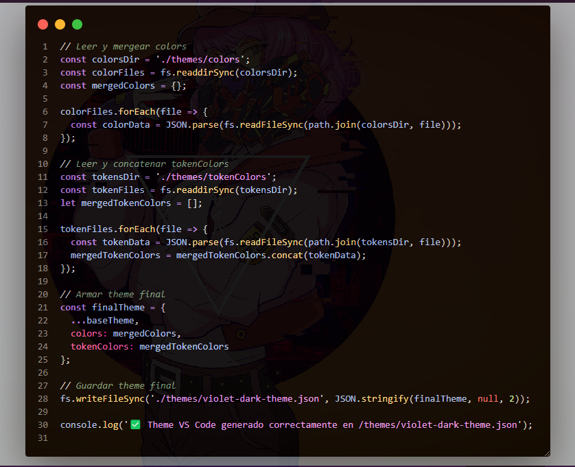

# 🖌️ Dark Themes – Dark Collection

A sleek, minimalistic collection of custom Visual Studio Code themes by **ZomboySoul**, inspired by neon lights, cyberpunk aesthetics, and deep night-time color palettes.

> Includes **Violet Dark** and **Orange Dark** variants, with more on the way.

---

## ✨ Included Themes

### 🌌 Violet Dark
A futuristic dark theme with vibrant purples, violets, and neon magentas.  
Ideal for night-time coding with a soft cyberpunk glow.

### 🔥 Orange Dark
A warm and energetic dark theme with bright oranges, golds, and burnt amber tones.  
Perfect for focused, high-contrast workflows.

---

## 🎨 Features

- ✅ Deep, eye-friendly backgrounds for reduced eye strain.
- 🎯 Precise syntax highlighting for clarity across many languages.
- ✍️ Elegant contrasts for readability and accessibility.
- 💡 Carefully tuned colors for:
  - Functions, methods, variables.
  - Strings, numbers, and keywords.
  - JSON keys/values.
  - Comments and markup.

Supported languages:
- **JavaScript / TypeScript**
- **Python**
- **HTML / CSS / SCSS**
- **JSON**
- **Markdown**
- ...and more

---

## 🖼️ Previews

### Violet Dark


### Orange Dark

---

## 📦 Installation

If installing manually:

```bash
code --install-extension dark-themes.vsix
```

Or search `dark Themes` in the **Extensions Marketplace**.

---

## 🧠 Tips for Best Experience

- Pair with fonts like `Fira Code`, `JetBrains Mono`, or `Cascadia Code`.
- Use in low-light environments to enjoy subtle glows.
- Customize with transparent window effects if your OS supports it.

---

## 🗂 Repository

Explore the source and contribute here:  
🔗 [https://github.com/ZomboySoul/dark-themes](https://github.com/ZomboySoul/dark-themes)

---

## 📖 License

Licensed under the [MIT License](https://opensource.org/licenses/MIT).
