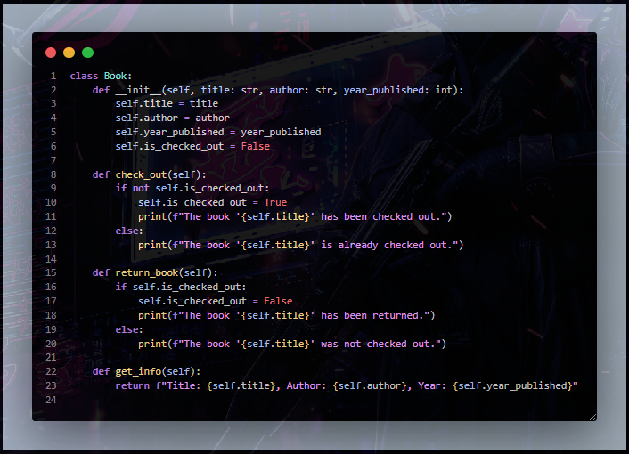
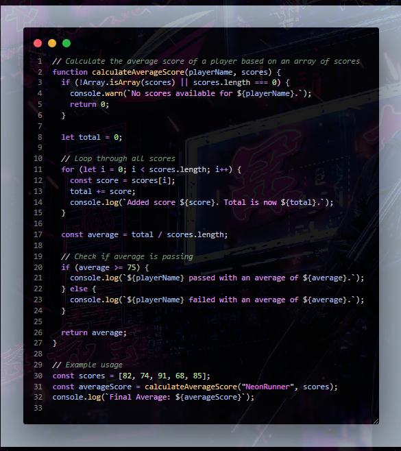

# 🌌 Violet Dark Theme

Un theme futurista y minimalista para Visual Studio Code, inspirado en las luces de neón, los paisajes cyberpunk y la programación nocturna.
Perfecto para quienes buscan una atmósfera oscura elegante con detalles vibrantes en tonos púrpuras, violetas y acentos neón.

---

## ✨ Características

🎨 Paleta cromática moderna y relajante:

- 🖤 Tonos oscuros profundos que reducen la fatiga visual.
- 💜 Paleta de colores con acentos en violetas, púrpuras y magentas.
- ✨ Contrastes suaves y elegantes para facilitar la lectura.
- 🌃 Inspirado en entornos nocturnos de estilo futurista

📝 Soporte de sintaxis mejorado para:

- **JSON**
- **CSS**
- **HTML**
- **Python**
- **JavaScript**
- **TypeScript**
- **y más...**

🔍 Resaltado optimizado de:

- 🛠️ Nombres de funciones, variables y métodos.
- 💬 Cadenas de texto diferenciadas.
- 📑 Claves y valores en JSON.
- 💭 Comentarios estilizados con tono distintivo.
- 🔢 Números y palabras clave resaltadas.

---

## 🖥️ Vista Previa

Sumergite en esta atmósfera oscura:


## 📦 Instalación

Si descargaste el archivo VSIX manualmente:

```bash
code --install-extension violet-dark-theme.vsix
```

## 📌 Recomendaciones

Para una experiencia completa:

- Activá ligera opacidad o vibrancy effect si tu sistema operativo lo permite.
- Combiná con una tipografía futurista como `Fira Code`, `JetBrains Mono` o `Cascadia Code`.
- Usalo en entornos oscuros para realzar los acentos neón.

## 📖 Licencia

Este proyecto está licenciado bajo la licencia [MIT](https://opensource.org/licenses/MIT).
